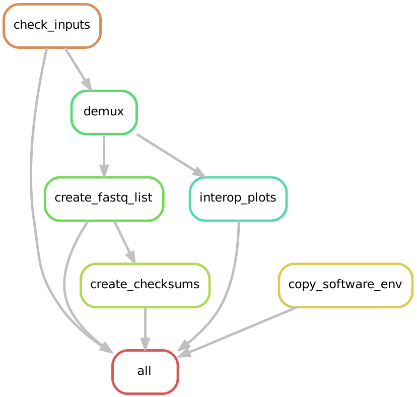
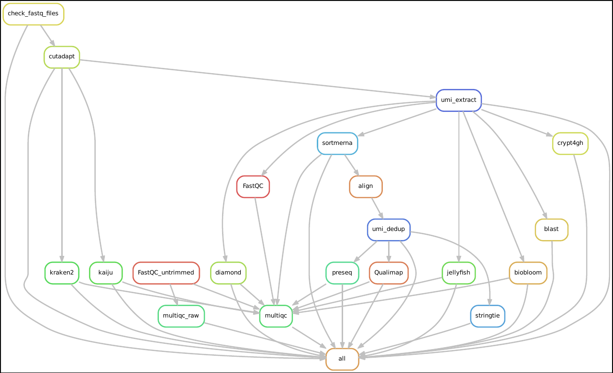
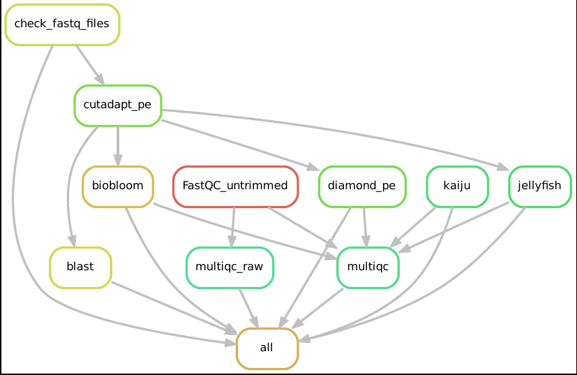
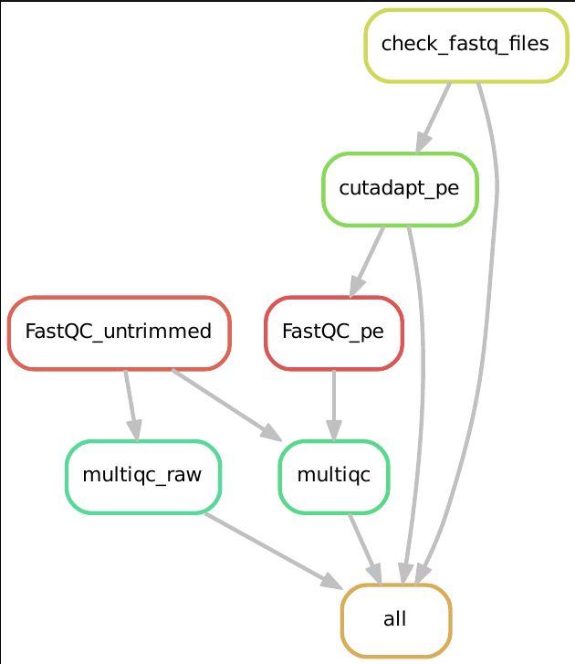

# Demultiplexing Pipeline for Illumina Machines with extensive QC

This Pipeline uses Snakemake 8 on a PBS Pro HPC Cluster to Demultiplex Illumina Sequencing Runs, either with bcl2fastq2 or the newer bclconvert.

#  Deployment
if you are HILBERT HPC user:

 `bash setup_pipeline.sh`

if not: 
 - create your snakemake profile if needed
 - create a conda env with `conda env create -n smk8 -f smk8_environment.yml`
 - `conda activate smk8 ` <- this env should then include snakemake 8.x.x

then:
 - edit the config.yaml file. This is where all the settings are for this Pipeline. Only use tools that you need!

then:

`bash runPipeline.sh`

# Examples
The Pipeline is split into two main Parts:
- the demultiplexing (rules/convert2fastq.smk)
- all other things (fastqProcessing.smk + all other .smk files in rules/)

For example DAGs and Reports, check the examples/ folder inside this repo

The demultiplexing part creates its own DAG, in a minimal setting this looks like:

Possible configuration DAG for the second part of the Pipeline:

If enabling less and working with pe data, the DAG can also look like:

Only enabling trimming with cutadapt given pe data yields this dag:

# General remarks: The Pipeline 
- is setup to always use the config.yaml in the root folder
- expects bcl2fastq2/bclconvert to be somewhere as executable (needs to be set in config.yaml)
- always does some basic steps like sha256sums / fastqc + multiqc reports
- is best to use one pipeline run per project and one project per sequencing run. That means if you have 2 or more projects in one flowcell/ sequencing run, you can eiter 
    -- split the samplesheet by project, run the pipeline once for each project but get a big undetermined.fastq.gz file or
    -- run once, but then mapping and all other after-mapping qc steps can only be made with one reference genome, and not one reference genome per project
    -- in essence, split the samplesheet if you want to do mapping or even more and if you only want to do basic qc on all the included projects one samplesheet is also a solution
    -- you can also demultiplex once, move/ copy the .fastq files and then use the skip_demux option to run the pipeline with one set of parameters for each project. This is the most ressource-efficient way for now.
- can deal with .fastq files as input (if demultiplexing already happened), for this enable the skip_demux part in the config.yaml
- can deal with paired and and single read sequencing setups. Diamond does not work with pe setups, and the naming scheme is strict (see config.yaml)
- if qc steps are enabled that require trimming of adapters, but trimming is disabled the pipeline will trimm regardless. This is to ensure the proper input quality of data for each step.
- The major focus here is demultiplexing of MiSeq/Nextseq2000/NovaseqX and do RNASeq analysis until transcript count tables are created
- can deal with UMIs, even in paired end setups (check config.yaml)
- collects qc of raw sequencing output in a multiqc file, and output of all analysis steps in a multiqc_report_complete file.
- general deletion of data does not happen. You need to cleanup on your own.
- expects a RunFolder as input that includes a SampleSheet. The SampleSheet needs to have a number (ProjectID) in the Filename. The RunFolder is where the demultiplexing then starts. The Samplesheet cannot be outside the root folder of the RunFolder created by Illuminas machines. See config.yaml for an example.
- SampleSheet and OutputFolder are the only 2 required inputs in the config.yaml, all other steps can be disabled.
- currently uses RSeQC as post-mapping QC for RNASeq runs, but only the for us useful modules of RSeQC.
- includes many QC steps to identify contamination, from most reliable to least: Kraken , BioBloom, BLAST, Diamond. Please be aware that either results are dependent on Quality of the input and the Database used.
- automatically scales up the ressources for each job after a failed attempt. after 3 attempts it gives up - you can configure this in your snakemake profile.
- many results of analyses are shown in the multiqc report complete file, but a lot of tools also put out more data then multiqc catches. Check the output folder after each run for more!

# Setup steps needed
- install the correct star version and create a reference genome, include a annotation .gtf file that you can use later in the pipeline during this step. Reference genomes can be downloaded from ncbi, ensembl or anywhere else. Download .fa(sta) and corresponding .gtl file, then do `star --runMode GenomeGenerate ` . the resulting Folder and gtf file can then be used in the config.yaml
- download binaries for bcl2fastq2 and/or bclconvert. This is sadly only available on the illumina website with a login. The complete path to the executables can then be filled in to the config.yaml
- create / download kraken2 / biobloomtools / blast / diamond / sortmerna databases. Most tools have downloadable databases available. Best is to start there and then adjust to your needs. The file paths can then be filled into the config.yaml. For biobloomtools, each organism needs one .bf file that need to be chained one after the other. All biobloomfilter .bf files need to be in the same, biobloom_filter_dir that also needs to be filled into the config.yaml file. Sortmerna needs also a special way: the reference list needs to be split by --ref for each specific file like so:
config.yaml: sortmerna, sortmerna_reference_list: '--ref /path/to/file1 --ref /path/to/file2 --ref /path/to/file3' ... and so on 
- all software should be handed by snakemake / conda except: 
    - bcl2fastq2
    - bclconvert
    - illumina_interop
    - Qualimap (since the conda install is broken on our HPC)
- blast_script_dir, interop_script_path are the folder scripts/ in this repo, so filling in only "scripts/" should also work for both
- start with only minimal options enabled, then enable more as you get familiar with how to fill in / use the config.yaml file. If you need inspiration, check the examples/ folder included in this dir.
- kraken2 is okay with UMIs, biobloom, blast and diamond not. This is why kraken2 is started before the UMIs are potentially moved to the .fastq header, giving you a sooner glimpse of potential contamination

# Tools included / steps available
- demultiplex with bcl2fastq2 or bclconvert (needs to be available as executable)
- FastQC, Fastp, sha256sums and MultiQC of raw demultiplexing output 
- ability to automatically reverse-complement the samplesheet info for second index read
- can automatically skip demultiplexing if .fastq.gz files are already somewhere
## Second part
- Illumina Interop and demux stats in second MultiQC report (..report_complete.html)
- cutadapt
- umi_tools
- sortmerna
- FastQC, MultiQC, sha256sums of trimmed/Umis moved to header / rRNA removed .fastq files
- contamination detection with:
    - Kraken2
    - BioBloom
    - BLAST
    - Diamond
    - Kaiju
- Jellyfish for k-mer distribution checks
- encryption of .fastq files with crypt4gh, encryption of all output with gocryptfs also possible
- automatic transport of all output data to other server/ scp adress
## RNA-Seq Workflow in the second part
- Mapping with STAR
- RseQC and samtools-plots for mapping output QC
- preseq for sequencing saturation estimation
- stringtie
- featurecounts for final transcript count table

- can work with pe/se data, can also work with dual UMI setup
- ends in a final MultiQC report that includes a overview of all analysis done and a list of used software
- copies samplesheet / config.yaml / software versions into output folder
- includes creating snakemake rulegraphs and reports for each run

# The runPipeline scripts
The snakemake pipeline itself is executed with the runPipeline(local).sh script.
This adds useful information like DAGs, snakemake reports and checksums.
If needed, this can be ignored and only the snakemake itself can be executed.
requirements for the runPipeline.sh script to work properly:
  + is executed in an interactive job that itself runs inside a screen
  + a conda environment "smk8" needs to be available to the executing user with snakemake 8.x installed in that environment
  + Execution happens on the local HPC Hilbert